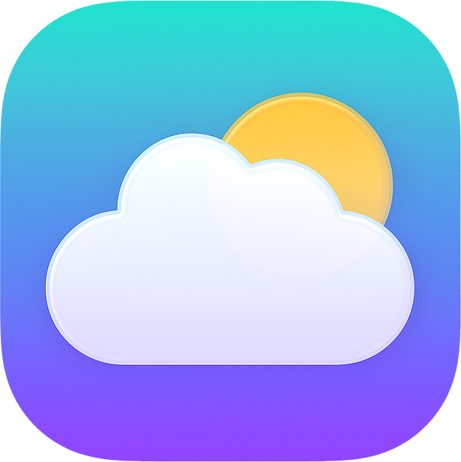
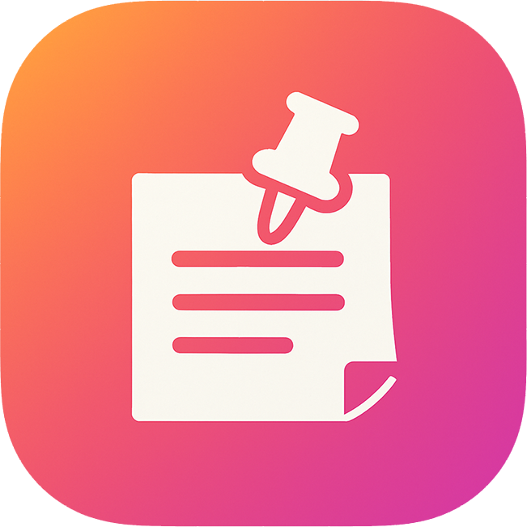

# Hi there, I'm Josh! 
I’m a passionate developer who loves crafting **beautiful, intuitive applications** with a focus on **iOS development, web technologies, and UI/UX design**.  
I enjoy building apps that **solve real problems** and **create delightful user experiences** while upholding a **strict commitment to user privacy** by collecting **zero data**.

Check out my projects and experience on my website:  
[**joshmansfielddevelopment.com**](https://www.joshmansfielddevelopment.com)

##  Featured iOS Apps

<table>
<tr>
<td align="center" width="25%">
 
<strong>Cumulus</strong> 
A weather app using WeatherKit, widgets and  liquid glass design. 
 
 
 

</td>
<td align="center" width="25%">
 
<strong>FlipCards</strong> 
Smart learning tool with themes and a quiz modes for fun studying. 
 
 
 

</td>
<td align="center" width="25%">
 
<strong>PinBoard</strong> 
Reminders app with cursomisation, widgets and live activities. 
 
 
 

</td>
<td align="center" width="25%">
 
<strong>TailTag</strong> 
Logbook for aviation enthusiasts to track aircraft sightings. 
 
 
 

</td>
</tr>
</table>

## Stats

## Tech Stack

### Languages & Frameworks

### Web Technologies

### Databases & Tools

### Specializations
- **iOS Development** - Native apps with SwiftUI, Core Data, WidgetKit
- **Web Development** - Full-stack development with modern frameworks
- **UI/UX Design** - Creating intuitive and beautiful user experiences
- **UEFN & Verse** - Unreal Engine development and scripting

##  What I Love
-  Building native iOS with Swift and SwiftUI
-  Crafting beautiful, accessible user interfaces
-  Creating responsive web experiences
-  Game development with Unreal Engine
-  Bears 🐻 (you may have noticed from my profile picture)
---
