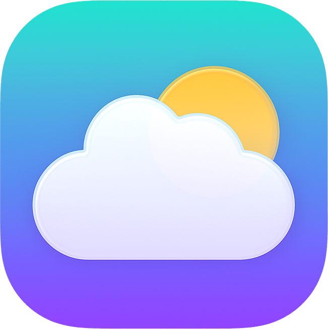

<h1 align="center">Josh Mansfield</h1>

  iOS / Web Developer • UI/UX Focused Builder 

  I build polished apps that solve real problems with thoughtful design and zero data collection by default.

  <a href="https://www.joshmansfielddevelopment.com"><strong>Website</strong></a>
  •
  <a href="https://appsbyjosh.com"><strong>App Portfolio</strong></a>

---

## Featured Apps

<table>
  <tr>
    <td align="center" width="50%">
       
      <strong>Cumulus</strong> 
      Clean weather experience built with WeatherKit, widgets, and a liquid-glass aesthetic.  
      
      
      
    </td>
    <td align="center" width="50%">
       
      <strong>FlipCards</strong> 
      Smart study companion with customizable themes and quiz modes for active recall.  
      
      
      
    </td>
  </tr>
  <tr>
    <td align="center" width="50%">
       
      <strong>PinBoard</strong> 
      Reminder and notes app with deep customization, widgets, and Live Activities support.  
      
      
      
    </td>
    <td align="center" width="50%">
       
      <strong>TailTag</strong> 
      Aviation spotter logbook for recording aircraft sightings quickly and beautifully.  
      
      
      
    </td>
  </tr>
</table>

---

## GitHub Stats

  
  

---

## Tech Stack

### Languages

### Web

### Tools

---

## Focus Areas

- Native iOS development with SwiftUI, WidgetKit, and modern Apple frameworks
- Product-quality UI/UX with an emphasis on clarity, speed, and accessibility
- Full-stack web builds using JavaScript, React, Flask, and SQL
- UEFN and Verse experimentation for interactive game experiences

## Outside Code

- Building thoughtful tools that make everyday tasks easier
- Iterating on visual details until they feel effortless
- Bears 🐻 (you may have noticed from the profile picture)
